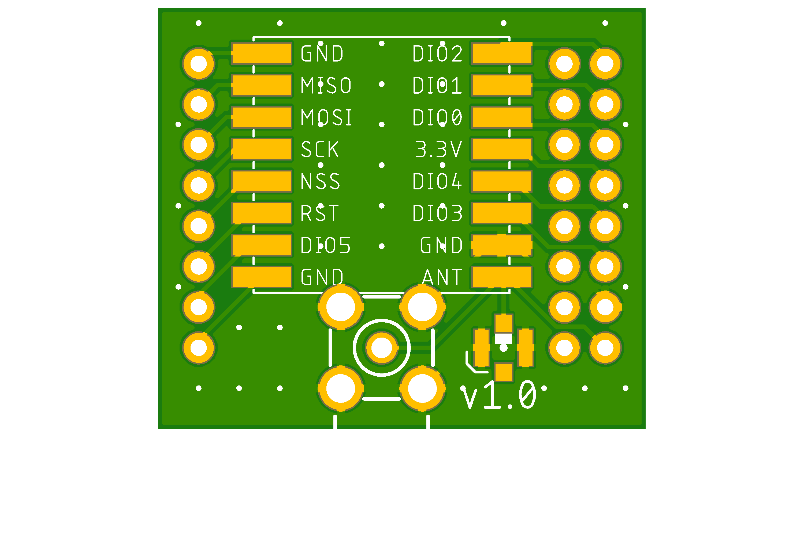
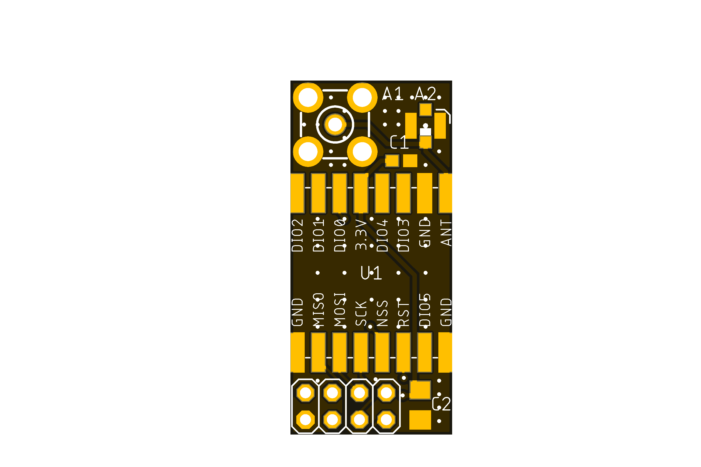

# LoRaBaseBoard

My LoRa Base Board for RFM95/96/97/98.

One day I wanted to play with LoRa in sender-receiver setup.
What I have fount there are a lot of SMD-mountable modules available but no modules suitable for common prototyping breadboards.
Here I've tried to create a user friendly way to use commonly available LoRa modules.

## LoRaBaseBoard

Simple adapted board intended to be used with variety of RFM LoRa radio modules and being used for HW prototyping.

Preview:

[Schematics in PDF format](LoRaBaseBoard.pdf)

Features:

- generic board for RFM radio modules
- compatible with common breadboards and prototyping boards (2.54mm raster)

CAM files are available.

## LoRaAdapter

This adapter board is meant to be a drop-in replacement for NRF24L01 modules.

Preview:

[Schematics in PDF format](LoRaAdapter.pdf)

Features:

- generic board for RFM95/96/97/98 LoRa radio modules
- compatible with NRF24L01 pinout

CAM files are available.

## BOM

Bill Of Materials is currently available only for LCSC Electronic Components Distributor, which is probably cheapest anyway.

### LCSC BOM

|Designator  |Part/Value  |Package/Footprint     |LCSC # |
|------------|------------|----------------------|-------|
|C1          |Cap. 100nF  |0603                  |C14663 |
|C2          |Cap. 22uF   |1206                  |C5672  |
|A1          |SMA conn.   |                      |C496551|
|A2          |U.FL conn.  |SMD                   |C88374 |

All passive components are optional!

## How to help

Your contributions as code, resources or finances are welcome!
Please contact me directly over e-mail andriy.golovnya@gmail.com or over [GitHub profile](https://github.com/red-scorp).
Link for [Paypal donations](http://paypal.me/redscorp), which are always welcome.
Thanks in advance!
